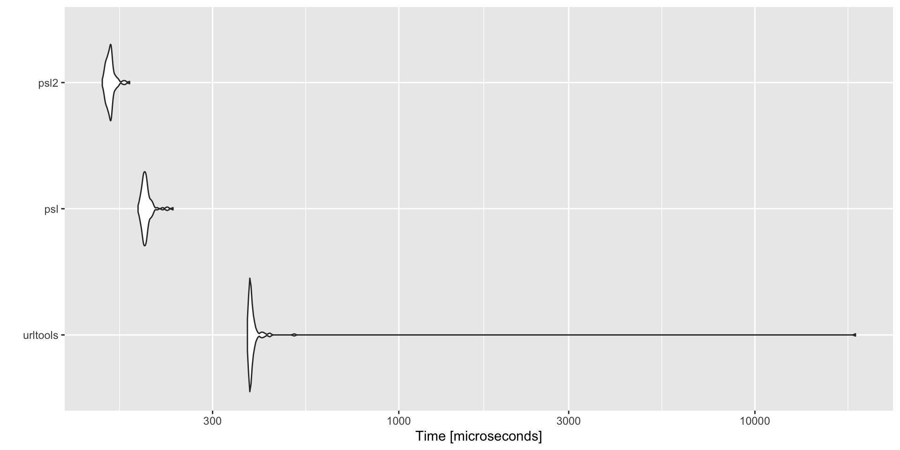

# psl

Extract Internet Domain Components Using the Public Suffix List

## Description

The ‘Public Suffix List’ (<https://publicsuffix.org/>) is a collection
of top-level domains (‘TLDs’) which include global top-level domainsa
(‘gTLDs’) such as ‘.com’ and ‘.net’; country top-level domains
(‘ccTLDs’) such as ‘.de’ and ‘.cn’; and, brand top-level domains such
as ‘.apple’ and ‘.google’. Tools are provided to extract internet domain
components using the public suffix list base data.

  - `libpsl`: <https://github.com/rockdaboot/libpsl>
  - Public Suffix List: <https://publicsuffix.org/>

## What’s Inside The Tin

The following functions are implemented:

  - `apex_domain`: Return the apex/top-private domain from a vector of
    domains
  - `is_public_suffix`: Test whether a domain is a public suffix
  - `public_suffix`: Return the public suffix from a vector of domains
  - `suffix_extract`: Separate a domain into component parts
  - `suffix_extract2`: Separate a domain into component parts (urltools
    compatible output)

## PRE-Installation

You need a recent `libpsl`.

  - macOS: `brew install libpsl`
  - Debian/Ubuntu-ish: Many repos have old versions so build from source
    and run `ldconfig` afterwards
  - Windows: Just use `urltools::suffix_extract()`

## Installation

``` r
devtools::install_github("hrbrmstr/psl")
```

## Usage

``` r
library(psl)
library(tidyverse)

# current verison
packageVersion("psl")
## [1] '0.1.0'
```

``` r
doms <- c(
  "", "com", "example.com", "www.example.com",
  ".com", ".example", ".example.com", ".example.example", "example",
  "example.example", "b.example.example", "a.b.example.example",
  "biz", "domain.biz", "b.domain.biz", "a.b.domain.biz", "com",
  "example.com", "b.example.com", "a.b.example.com", "uk.com",
  "example.uk.com", "b.example.uk.com", "a.b.example.uk.com", "test.ac",
  "cy", "c.cy", "b.c.cy", "a.b.c.cy", "jp", "test.jp", "www.test.jp",
  "ac.jp", "test.ac.jp", "www.test.ac.jp", "kyoto.jp", "test.kyoto.jp",
  "ide.kyoto.jp", "b.ide.kyoto.jp", "a.b.ide.kyoto.jp", "c.kobe.jp",
  "b.c.kobe.jp", "a.b.c.kobe.jp", "city.kobe.jp", "www.city.kobe.jp",
  "ck", "test.ck", "b.test.ck", "a.b.test.ck", "www.ck", "www.www.ck",
  "us", "test.us", "www.test.us", "ak.us", "test.ak.us", "www.test.ak.us",
  "k12.ak.us", "test.k12.ak.us", "www.test.k12.ak.us"
)

apex_domain(doms)
##  [1] NA                NA                "example.com"     "example.com"     NA                NA               
##  [7] NA                NA                NA                "example.example" "example.example" "example.example"
## [13] NA                "domain.biz"      "domain.biz"      "domain.biz"      NA                "example.com"    
## [19] "example.com"     "example.com"     NA                "example.uk.com"  "example.uk.com"  "example.uk.com" 
## [25] "test.ac"         NA                "c.cy"            "c.cy"            "c.cy"            NA               
## [31] "test.jp"         "test.jp"         NA                "test.ac.jp"      "test.ac.jp"      NA               
## [37] "test.kyoto.jp"   NA                "b.ide.kyoto.jp"  "b.ide.kyoto.jp"  NA                "b.c.kobe.jp"    
## [43] "b.c.kobe.jp"     "city.kobe.jp"    "city.kobe.jp"    NA                NA                "b.test.ck"      
## [49] "b.test.ck"       "www.ck"          "www.ck"          NA                "test.us"         "test.us"        
## [55] NA                "test.ak.us"      "test.ak.us"      NA                "test.k12.ak.us"  "test.k12.ak.us"

public_suffix(doms)
##  [1] ""             "com"          "com"          "com"          ".com"         ".example"     "com"         
##  [8] "example"      "example"      "example"      "example"      "example"      "biz"          "biz"         
## [15] "biz"          "biz"          "com"          "com"          "com"          "com"          "uk.com"      
## [22] "uk.com"       "uk.com"       "uk.com"       "ac"           "cy"           "cy"           "cy"          
## [29] "cy"           "jp"           "jp"           "jp"           "ac.jp"        "ac.jp"        "ac.jp"       
## [36] "kyoto.jp"     "kyoto.jp"     "ide.kyoto.jp" "ide.kyoto.jp" "ide.kyoto.jp" "c.kobe.jp"    "c.kobe.jp"   
## [43] "c.kobe.jp"    "kobe.jp"      "kobe.jp"      "ck"           "test.ck"      "test.ck"      "test.ck"     
## [50] "ck"           "ck"           "us"           "us"           "us"           "ak.us"        "ak.us"       
## [57] "ak.us"        "k12.ak.us"    "k12.ak.us"    "k12.ak.us"

is_public_suffix(doms)
##  [1]  TRUE  TRUE FALSE FALSE  TRUE  TRUE FALSE FALSE  TRUE FALSE FALSE FALSE  TRUE FALSE FALSE FALSE  TRUE FALSE FALSE
## [20] FALSE  TRUE FALSE FALSE FALSE FALSE  TRUE FALSE FALSE FALSE  TRUE FALSE FALSE  TRUE FALSE FALSE  TRUE FALSE  TRUE
## [39] FALSE FALSE  TRUE FALSE FALSE FALSE FALSE  TRUE  TRUE FALSE FALSE FALSE FALSE  TRUE FALSE FALSE  TRUE FALSE FALSE
## [58]  TRUE FALSE FALSE

suffix_extract(doms)
## # A tibble: 60 x 6
##    orig             normalized       subdomain apex            domain  suffix  
##    <chr>            <chr>            <chr>     <chr>           <chr>   <chr>   
##  1 ""               ""               <NA>      <NA>            <NA>    ""      
##  2 com              com              <NA>      <NA>            <NA>    com     
##  3 example.com      example.com      ""        example.com     example com     
##  4 www.example.com  www.example.com  www       example.com     example com     
##  5 .com             .com             <NA>      <NA>            <NA>    .com    
##  6 .example         .example         <NA>      <NA>            <NA>    .example
##  7 .example.com     .example.com     <NA>      <NA>            <NA>    com     
##  8 .example.example .example.example <NA>      <NA>            <NA>    example 
##  9 example          example          <NA>      <NA>            <NA>    example 
## 10 example.example  example.example  ""        example.example example example 
## # ... with 50 more rows

suffix_extract2(doms) # urltools compatible output
##                   host subdomain  domain       suffix
## 1                           <NA>    <NA>             
## 2                  com      <NA>    <NA>          com
## 3          example.com           example          com
## 4      www.example.com       www example          com
## 5                 .com      <NA>    <NA>         .com
## 6             .example      <NA>    <NA>     .example
## 7         .example.com      <NA>    <NA>          com
## 8     .example.example      <NA>    <NA>      example
## 9              example      <NA>    <NA>      example
## 10     example.example           example      example
## 11   b.example.example         b example      example
## 12 a.b.example.example       a.b example      example
## 13                 biz      <NA>    <NA>          biz
## 14          domain.biz            domain          biz
## 15        b.domain.biz         b  domain          biz
## 16      a.b.domain.biz       a.b  domain          biz
## 17                 com      <NA>    <NA>          com
## 18         example.com           example          com
## 19       b.example.com         b example          com
## 20     a.b.example.com       a.b example          com
## 21              uk.com      <NA>    <NA>       uk.com
## 22      example.uk.com           example       uk.com
## 23    b.example.uk.com         b example       uk.com
## 24  a.b.example.uk.com       a.b example       uk.com
## 25             test.ac              test           ac
## 26                  cy      <NA>    <NA>           cy
## 27                c.cy                 c           cy
## 28              b.c.cy         b       c           cy
## 29            a.b.c.cy       a.b       c           cy
## 30                  jp      <NA>    <NA>           jp
## 31             test.jp              test           jp
## 32         www.test.jp       www    test           jp
## 33               ac.jp      <NA>    <NA>        ac.jp
## 34          test.ac.jp              test        ac.jp
## 35      www.test.ac.jp       www    test        ac.jp
## 36            kyoto.jp      <NA>    <NA>     kyoto.jp
## 37       test.kyoto.jp              test     kyoto.jp
## 38        ide.kyoto.jp      <NA>    <NA> ide.kyoto.jp
## 39      b.ide.kyoto.jp                 b ide.kyoto.jp
## 40    a.b.ide.kyoto.jp         a       b ide.kyoto.jp
## 41           c.kobe.jp      <NA>    <NA>    c.kobe.jp
## 42         b.c.kobe.jp                 b    c.kobe.jp
## 43       a.b.c.kobe.jp         a       b    c.kobe.jp
## 44        city.kobe.jp              city      kobe.jp
## 45    www.city.kobe.jp       www    city      kobe.jp
## 46                  ck      <NA>    <NA>           ck
## 47             test.ck      <NA>    <NA>      test.ck
## 48           b.test.ck                 b      test.ck
## 49         a.b.test.ck         a       b      test.ck
## 50              www.ck               www           ck
## 51          www.www.ck       www     www           ck
## 52                  us      <NA>    <NA>           us
## 53             test.us              test           us
## 54         www.test.us       www    test           us
## 55               ak.us      <NA>    <NA>        ak.us
## 56          test.ak.us              test        ak.us
## 57      www.test.ak.us       www    test        ak.us
## 58           k12.ak.us      <NA>    <NA>    k12.ak.us
## 59      test.k12.ak.us              test    k12.ak.us
## 60  www.test.k12.ak.us       www    test    k12.ak.us
```

``` r
library(microbenchmark)

microbenchmark(
  urltools = urltools::suffix_extract(doms),
  psl = psl::suffix_extract(doms), # returns more data
  psl2 = psl::suffix_extract2(doms) # returns what urltools does
) -> mb

autoplot(mb)
```


